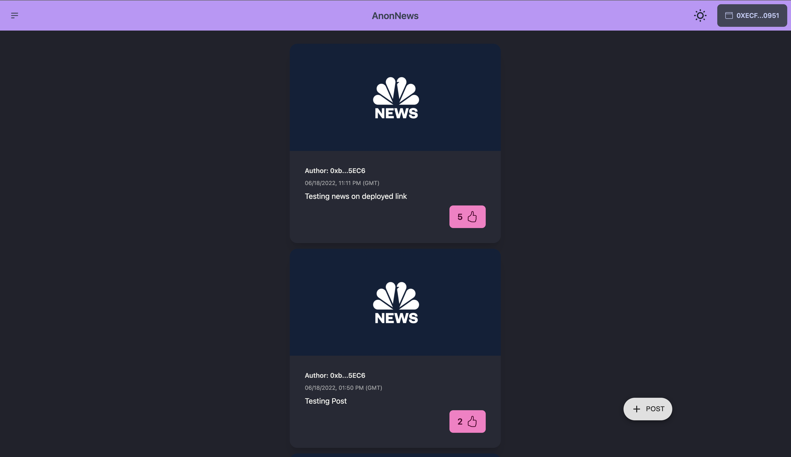

  
  

   
  

  <h1 align="center"><b>AnonNews</b></h1>
  

  A decentralised news platform
     
    <a href="https://anon-news.web.app/"><strong>anon-news.web.app »</strong></a>
     
     
  

AnonNews is an open source initiative to bring the real and uncensored news to the people. 
 
 

> NOTE: AnonNews is under active development, most of the listed features are still experimental and subject to change.

AnonNews is a platform build using the decentralised web technology which helps this application to be censorship free.

This application will let users post news and a media related to that news on the blockchain. While other users can vote these news posts, based on the number of votes the news with the maximum number of votes is shown first.

 

  
   

# Motivation

The main motivation behind this project is to remove under the table business of news platforms that are controlled by the big firms. This has made news a profit making business, which I think is a basic human right to get/know the correct and censor free news about the world.

# Architecture

- This project is using a Alchemy as a smart contract deployed node, the smart contract is written in Solidity.

- For the frontend the project is built on React Js with Material UI library.

- The images uploaded on the posts are stored using IPFS.

# How to use

> Note: This project is currently on the testing chain of ethereum (Rinkeby)

- The user would need a metamask wallet (recommended) to access the web app. You can head over to this [link](https://metamask.io/) and download the extension for your browser. 
- Create a new account on the metamask wallet. And switch you wallet to Rinkeby Test Network.

- Copy your public address from your wallet and add some test ETH to it by heading over to this [link](https://faucets.chain.link/rinkeby) . Just paste your public address and you'll be good to go.
- Posting a post in this web app will require an ethereum transaction as well as voting a post.
- User can also upload a media (image) with their posts.

 

> Use the web app wisely :)
